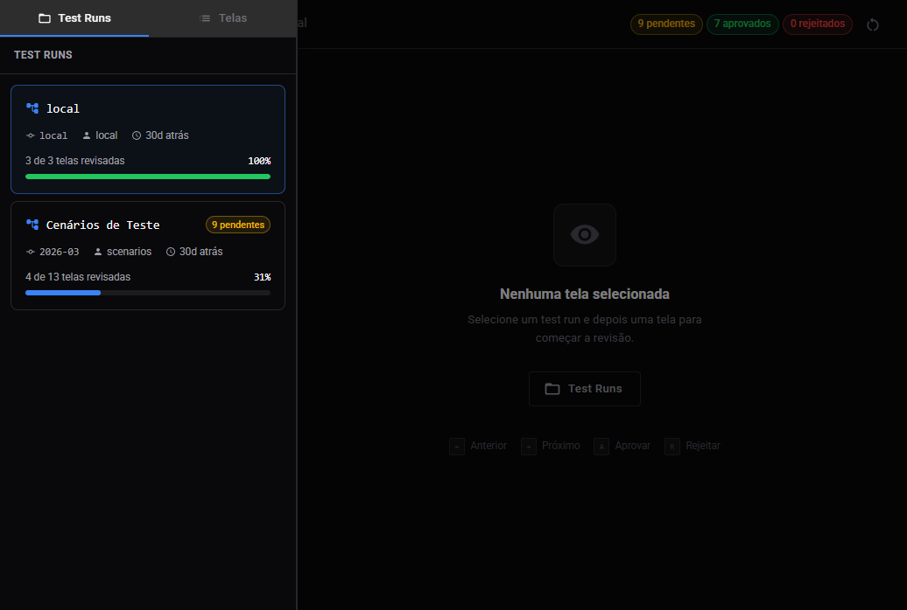
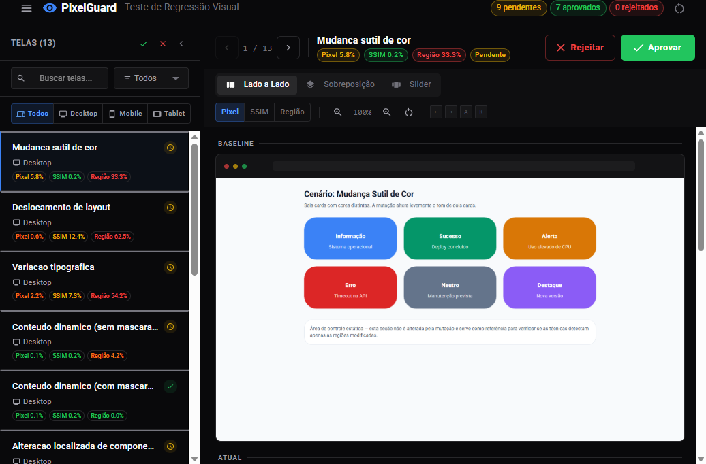
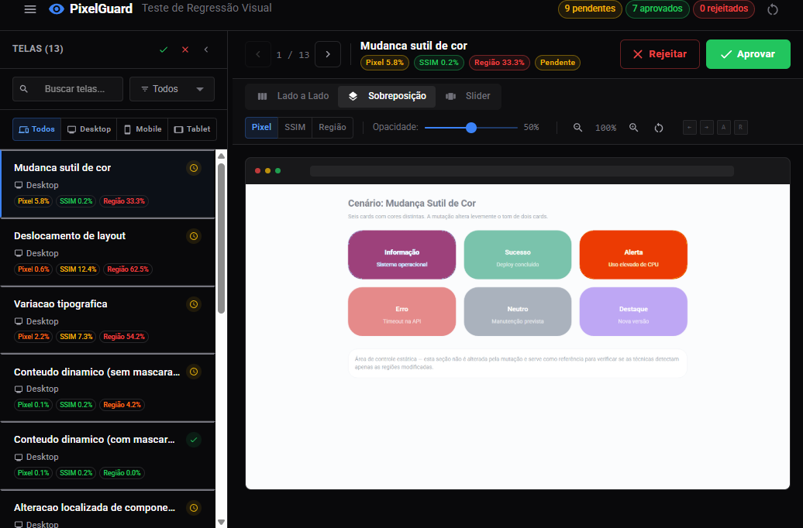
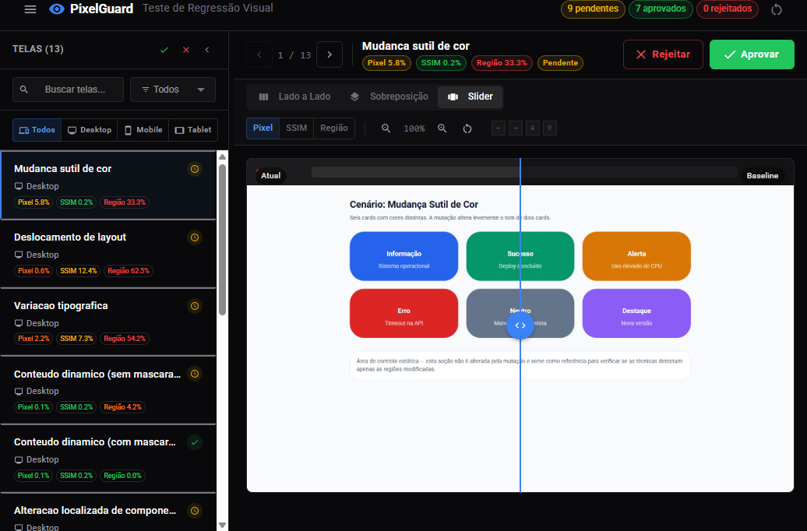
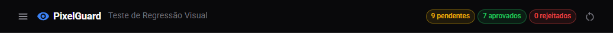
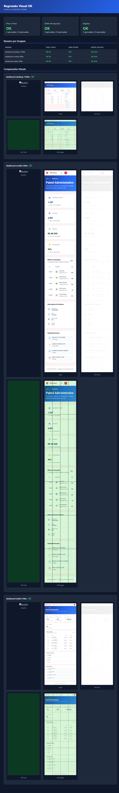
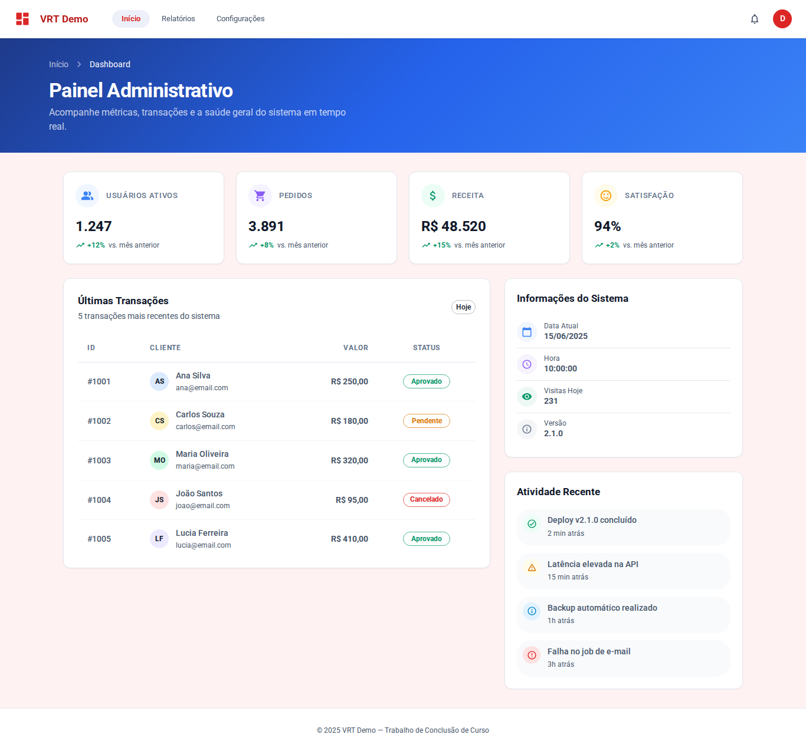
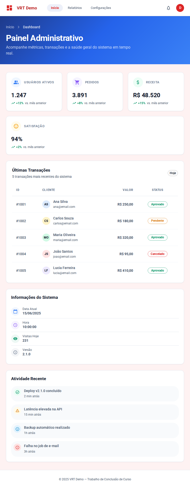
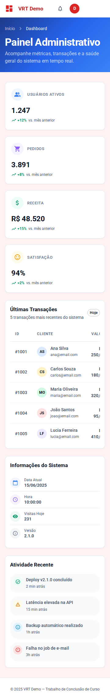

<p align="center">
  
</p>

<h1 align="center">PixelGuard — Regressão Visual para React</h1>

<p align="center">
  Pipeline completo de testes visuais que captura screenshots, compara com baselines usando <strong>3 técnicas</strong> (pixel a pixel, SSIM e regiões) e bloqueia o merge no GitHub quando há diferenças — com UI de review interativa.
</p>

<p align="center">
  
  
  
  
  
</p>

---

## Índice

1. [Visão Geral](#visão-geral)
2. [Arquitetura](#arquitetura)
3. [Pré-requisitos](#pré-requisitos)
4. [Instalação](#instalação)
5. [Configuração](#configuração)
6. [Uso Local](#uso-local)
7. [PixelGuard CLI](#pixelguard-cli)
8. [Review UI — Guia Completo](#review-ui--guia-completo)
9. [Relatório HTML](#relatório-html)
10. [Aplicação Dashboard (sujeito de teste)](#aplicação-dashboard-sujeito-de-teste)
11. [Cenários de regressão](#cenários-de-regressão)
12. [CI/CD — GitHub Actions](#cicd--github-actions)
13. [Comandos de Referência](#comandos-de-referência)
14. [Referência de Configuração](#referência-de-configuração)
15. [Estrutura do Projeto](#estrutura-do-projeto)

---

## Visão Geral

O PixelGuard automatiza a detecção de regressões visuais em aplicações web. O fluxo funciona assim:

```
Captura screenshots → Compara com baselines → Gera relatório → Abre review UI
       ↓                      ↓                     ↓                ↓
   Playwright            3 técnicas           report.html      localhost:8080
                     (pixel, SSIM, região)
```

### Técnicas de Comparação

| Técnica | Descrição | Sensibilidade |
|:--------|:----------|:-------------|
| **Pixel a pixel** | Compara cada pixel individualmente usando [pixelmatch](https://github.com/mapbox/pixelmatch). Detecta até alterações de 1px. | Alta |
| **SSIM** | Structural Similarity Index — métrica perceptual que avalia luminância, contraste e estrutura (Wang et al., 2004). Aproxima a visão humana. | Média |
| **Regiões** | Divide a imagem em grade (4×6), compara cada célula de forma independente e permite mascarar áreas dinâmicas (datas, contadores). | Configurável |

---

## Arquitetura

```
┌─────────────────────────────────────────────────────────────┐
│                      Aplicação React                        │
│              (src/ — React 19 + MUI 6 + Vite 6)            │
│                     porta 8000                              │
└──────────────────────────┬──────────────────────────────────┘
                           │ Playwright captura
                           ▼
┌─────────────────────────────────────────────────────────────┐
│              PixelGuard (pacote unificado)                   │
│           packages/pixelguard/ — CLI + Engine                │
│                                                             │
│  src/capture.js → src/compare.js → src/report.js            │
│                                                             │
│  Comparadores:                                              │
│    src/comparators/pixel.js   (pixelmatch)                  │
│    src/comparators/ssim.js    (SSIM — implementação)        │
│    src/comparators/region.js  (grade + máscaras)            │
│                                                             │
│  Review UI (embutida):                                      │
│    review/server/   → HTTP server + REST API (porta 8080)   │
│    review/dist/     → SPA React pré-buildada                │
└──────────────────────────┬──────────────────────────────────┘
                           │ GitHub Statuses API
                           ▼
┌─────────────────────────────────────────────────────────────┐
│                    GitHub Actions                           │
│  visual-regression.yml  → Check em PRs                     │
│  approve-visual.yml     → Comandos via comentário          │
│  update-baselines.yml   → Atualiza baselines pós-merge     │
└─────────────────────────────────────────────────────────────┘
```

---

## Pré-requisitos

| Ferramenta | Versão | Motivo |
|:-----------|:-------|:-------|
| **Node.js** | ≥ 20 | Runtime |
| **npm** | ≥ 9 | Gerenciador de pacotes |
| **Git** | Qualquer | Controle de versão |
| **Conta GitHub** | — | CI/CD e GitHub Pages |

---

## Instalação

### 1. Clonar o repositório

```bash
git clone https://github.com/douglasrosso/TCC.git
cd TCC
```

### 2. Instalar dependências

```bash
npm install
```

### 3. Instalar o navegador do Playwright

```bash
npx playwright install chromium
```

> **Nota:** O Playwright usa Chromium headless para capturar screenshots. Só é necessário instalar uma vez.

---

## Configuração

### Arquivo de configuração: `pixelguard.config.js`

Toda a configuração da pipeline está centralizada neste arquivo na raiz do projeto. Para criar um novo:

```bash
npx pixelguard init
```

Exemplo completo:

```javascript
/** @type {import('pixelguard').PixelGuardConfig} */
export default {
  // URL base da aplicação (null = auto-start Vite)
  baseUrl: null,
  port: 8000,

  /* Viewports para captura */
  viewports: [
    { name: 'mobile',  width: 360,  height: 640  },
    { name: 'tablet',  width: 768,  height: 1024 },
    { name: 'desktop', width: 1366, height: 768  },
  ],

  /* Páginas a capturar */
  pages: [
    { name: 'dashboard', path: '/' },
  ],

  /* Limiares de aceitação por técnica */
  thresholds: {
    pixel:  { tolerance: 0.1, maxDiffPercent: 0.1 },
    ssim:   { minScore: 0.98, blockSize: 8 },
    region: { gridCols: 4, gridRows: 6, maxDiffPercent: 1.0 },
  },

  /* Máscaras — células da grade a ignorar (regiões dinâmicas) */
  masks: [],

  /* Diretórios */
  baselinesDir: 'baselines',
  resultsDir: 'results',

  /* Congelar Date/Math.random para determinismo */
  freeze: true,

  /* Porta da Review UI */
  reviewPort: 8080,
};
```

#### Como adicionar novas páginas

Basta incluir uma entrada no array `pages`:

```javascript
pages: [
  { name: 'dashboard', path: '/' },
  { name: 'login',     path: '/login' },
  { name: 'settings',  path: '/settings' },
],
```

Cada página será capturada em **todos os viewports**, gerando arquivos como `dashboard-mobile-360w.png`.

#### `baseUrl` — auto-start ou URL externa

| Valor | Comportamento |
|:------|:--------------|
| `null` | PixelGuard inicia o Vite automaticamente na `port` configurada, captura, e encerra |
| `'http://localhost:3000'` | Usa uma URL externa já rodando (útil para Next.js, CRA, etc.) |

#### Como ajustar limiares

| Parâmetro | Técnica | Significado |
|:----------|:--------|:------------|
| `pixel.tolerance` | Pixel | Sensibilidade do pixelmatch (0–1). Menor = mais sensível |
| `pixel.maxDiffPercent` | Pixel | % máxima de pixels diferentes aceitável |
| `ssim.minScore` | SSIM | Score mínimo (0–1). Menor = mais tolerante |
| `ssim.blockSize` | SSIM | Tamanho do bloco para cálculo SSIM |
| `region.gridCols` / `gridRows` | Região | Divisão da grade |
| `region.maxDiffPercent` | Região | % máxima de diferença por célula |

#### Como usar máscaras

Máscaras ignoram células da grade que contêm conteúdo dinâmico (datas, contadores, etc.):

```javascript
masks: [
  { row: 0, col: 3 },  // Canto superior direito
  { row: 5, col: 0 },  // Canto inferior esquerdo
],
```

> `row` e `col` começam em 0, contados do canto superior esquerdo da grade.

---

## Uso Local

### Fluxo completo (um comando)

```bash
npm run vrt
```

Este comando executa o pipeline completo via `pixelguard test`:
1. **Captura** screenshots de todas as páginas e viewports
2. **Compara** com as baselines usando as 3 técnicas
3. **Gera** o relatório HTML em `results/report.html`

### Testar e revisar

```bash
npm run vrt:review
```

Executa o pipeline completo e em seguida abre a **Review UI** interativa na porta 8080.

### Primeiro uso — criar baselines iniciais

Na primeira vez (ou após mudanças visuais intencionais), crie as baselines de referência:

```bash
npx pixelguard capture
npx pixelguard update-baselines
```

Isso captura screenshots e os copia para `baselines/`. Depois, faça commit:

```bash
git add baselines/
git commit -m "chore: criar baselines iniciais"
```

### Atualizar baselines após mudança intencional

Quando uma alteração visual é **intencional** (novo tema, nova cor, novo componente), atualize:

```bash
npx pixelguard capture
npx pixelguard update-baselines
git add baselines/
git commit -m "chore: atualizar baselines"
```

### Executar etapas individualmente

```bash
npx pixelguard capture     # Captura screenshots → results/current/
npx pixelguard compare     # Compara com baselines → results/results.json
npx pixelguard report      # Gera relatório HTML → results/report.html
npx pixelguard review      # Inicia a Review UI → localhost:8080
```

---

## PixelGuard CLI

O PixelGuard inclui uma CLI unificada que pode ser usada diretamente via `npx pixelguard` ou através dos scripts do `package.json`:

```bash
npx pixelguard <command>
```

| Comando | Descrição |
|:--------|:----------|
| `init` | Cria `pixelguard.config.js` no projeto |
| `capture` | Captura screenshots de todas as páginas/viewports |
| `compare` | Compara capturas com baselines (3 técnicas) |
| `report` | Gera relatório HTML em `results/report.html` |
| `update-baselines` | Copia `results/current/` para `baselines/` |
| `test` | **Pipeline completo:** capture → compare → report |
| `review` | Inicia a Review UI interativa (porta 8080) |
| `deploy` | Build da Review UI + montar pasta de deploy estático |

Opções:

| Opção | Descrição |
|:------|:----------|
| `--help`, `-h` | Mostra ajuda |
| `--port <n>` | Porta para o servidor de review (padrão: 8080) |
| `--build` | Força rebuild da Review UI antes de iniciar |
| `--pr <n>` | Número do PR para nomear a pasta de deploy |
| `--out <dir>` | Diretório de saída para capture / deploy |

### Usando em outros projetos

```bash
npm install pixelguard --save-dev
npx pixelguard init
# Edite pixelguard.config.js com suas páginas e viewports
npx pixelguard test
```

---

## Review UI — Guia Completo

A Review UI é uma aplicação React com **tema escuro** que permite analisar diferenças visuais de forma interativa.

### Abrindo a Review UI

```bash
npx pixelguard review
```

Ou com porta customizada:

```bash
npx pixelguard review --port 4000
```

Acesse: **http://localhost:8080**

### Visão geral da interface



A interface é dividida em **3 painéis redimensionáveis**:

| # | Painel | Localização | Função |
|:-:|:-------|:-----------|:-------|
| 1 | **Test Runs** | Esquerda | Lista os test runs disponíveis (local ou CI). Mostra branch, commit, autor e progresso de review |
| 2 | **Diff List** | Centro-esquerda | Lista todas as telas comparadas com filtros por status, viewport e busca por nome |
| 3 | **Diff Viewer** | Área principal (direita) | Exibe a comparação visual entre baseline e captura atual |

### Selecionando e visualizando diffs



Ao clicar em um test run e depois em uma tela, o **Diff Viewer** exibe 3 imagens lado a lado:

| Imagem | Descrição |
|:-------|:----------|
| **Baseline** | Imagem de referência (da branch `main`) |
| **Atual** | Captura nova (da branch do PR ou local) |
| **Diff** | Mapa de diferenças com pixels alterados em destaque |

### Modos de visualização

A toolbar do Diff Viewer oferece **3 modos** de visualização:

#### 1. Side by Side (padrão)

Mostra baseline, atual e diff lado a lado. Ideal para comparação rápida.


#### 2. Overlay (sobreposição)

Sobrepõe a imagem atual sobre a baseline com **opacidade ajustável**. Útil para detectar deslocamentos sutis.



#### 3. Slider (deslizante)

Arraste o cursor horizontal para revelar a imagem atual sobre a baseline. Excelente para comparar regiões específicas.



### Elementos da interface em detalhe

#### Header



| Elemento | Descrição |
|:---------|:----------|
| **Logo PixelGuard** | Identifica a ferramenta |
| **Status geral** | Mostra o estado atual da review (pendente / aprovado / rejeitado) |
| **Botão Aprovar (✓)** | Aprova todas as diferenças visuais. Em modo CI, atualiza o status do PR no GitHub para `success` |
| **Botão Rejeitar (✕)** | Rejeita as diferenças. O merge permanece bloqueado (status `failure`) |
| **Botão Resetar** | Volta o status para "pendente" |
| **Informações CI** | Em modo CI, exibe branch, commit SHA, número do PR e autor |

#### Painel de Test Runs (esquerda)

Cada card mostra:

| Campo | Descrição |
|:------|:----------|
| **Branch** | Nome da branch (ex: `feature/novo-tema`) |
| **Commit** | Hash curto do commit |
| **Autor** | Quem fez o push |
| **Timestamp** | Quando a comparação foi executada (ex: "5min atrás") |
| **Barra de progresso** | Porcentagem de telas revisadas |
| **Badge amarelo** | Quantidade de telas pendentes de review |

#### Painel de Diff List (centro)

Cada item da lista exibe:

| Campo | Descrição |
|:------|:----------|
| **Nome da tela** | Ex: `dashboard` |
| **Ícone de viewport** | 📱 Mobile, 📋 Tablet, 🖥️ Desktop |
| **Status** | ⏳ Pendente (amarelo), ✅ Aprovado (verde), ❌ Rejeitado (vermelho) |
| **Badges de técnica** | Quais técnicas detectaram diferença (Pixel, SSIM, Região) |

**Filtros disponíveis:**

| Filtro | Opções |
|:-------|:-------|
| **Busca** | Filtra por nome da tela (campo de texto) |
| **Status** | Todos · Pendentes · Aprovados · Rejeitados |
| **Viewport** | Todos · Mobile · Tablet · Desktop |

#### Diff Viewer — Toolbar

| Controle | Descrição |
|:---------|:----------|
| **Modo de visualização** | Alterna entre Side by Side, Overlay e Slider |
| **Zoom (+/−/reset)** | Controla o zoom das imagens |
| **Seletor de técnica** | Alterna entre Pixel, SSIM e Região para ver o diff de cada técnica |
| **Navegação (← →)** | Navega para a tela anterior ou próxima |

**Atalhos de teclado:**

| Tecla | Ação |
|:------|:-----|
| `A` | Aprovar tela selecionada (somente quando há diferenças que falharam) |
| `R` | Rejeitar tela selecionada (somente quando há diferenças que falharam) |
| `←` / `→` | Navegar entre telas |

### Aprovação automática

Quando **todas as técnicas de comparação** passam nos limiares configurados, a tela é **aprovada automaticamente** — não requer revisão manual.

- Os botões Aprovar / Rejeitar ficam ocultos
- O ícone de status mostra ✅ aprovado
- Uma mensagem indica o resultado:
  - **"Nenhuma diferença visual detectada"** — quando todas as técnicas retornam 0% de diferença
  - **"Diferenças dentro do limiar aceitável"** — quando há pequenas diferenças, mas dentro dos thresholds
- O botão **"Ver imagens mesmo assim"** permite visualizar a comparação completa (baseline × atual) mesmo sem diferenças

### Integração com GitHub (modo CI)

Quando executada em modo CI (via GitHub Pages), a Review UI se comunica com a **API de Statuses do GitHub**:

| Ação | Status do commit | Efeito no merge |
|:-----|:----------------|:----------------|
| **Aprovar** | `success` | Merge liberado ✅ |
| **Rejeitar** | `failure` | Merge bloqueado ❌ |
| **Resetar** | `pending` | Merge bloqueado (aguardando review) ⏳ |

> O token do GitHub é criptografado via XOR no CI e descriptografado no browser — isso evita que o GitHub Push Protection bloqueie o deploy.

---

## Relatório HTML

Além da Review UI interativa, o pipeline gera um **relatório HTML estático autocontido**:



O relatório inclui:

| Seção | Conteúdo |
|:------|:---------|
| **Banner de status** | Indica se o merge está bloqueado ou liberado |
| **Cards de resumo** | Resultado por técnica (Pixel, SSIM, Região) — OK ou FAIL |
| **Metadados** | Commit, branch, PR, autor (quando gerado no CI) |
| **Tabela por imagem** | % de diferença (pixel), score (SSIM), regiões com falha |
| **Comparações visuais** | Baseline, captura atual e mapas de diff para cada técnica |

O arquivo é gerado em `results/report.html` e pode ser aberto diretamente no navegador.

---

## Aplicação Dashboard (sujeito de teste)

A aplicação React (Material UI) em [`src/`](src) é uma single-page que simula um painel administrativo com tabela de transações, métricas e gráficos. Ela é o alvo principal das comparações da pipeline e é capturada com determinismo (relógio congelado, `Math.random` fixo, animações desativadas).

| Viewport | Captura |
|:---|:---|
| Desktop · 1366 × 768 |  |
| Tablet · 768 × 1024 |  |
| Mobile · 360 × 640 |  |

---

## Cenários de regressão

Além da tela `dashboard`, o comando `npm run scenarios` executa **13 cenários** projetados para isolar tipos específicos de mudança visual e expor pontos fortes e fracos de cada técnica. Cada composite abaixo mostra, em uma única linha: **Baseline · Atual · Diff Pixel · Diff SSIM · Diff Região**, com o veredicto e a métrica principal de cada técnica.

Os 13 composites são gerados automaticamente a partir de [`results/scenarios/scenarios-results.json`](results/scenarios/scenarios-results.json) pelo script [`scripts/capture-scenarios.js`](scripts/capture-scenarios.js), de modo que ficam sempre sincronizados com a última execução.

| Cenário | Composite | Mutação injetada | Resultado esperado |
|---|---|---|---|
| Mudança sutil de cor | [color-subtle.png](docs/images/scenarios/color-subtle.png) | troca de tom em 2 de 6 cards (Δ 22–37 RGB por canal) | Pixel detecta, SSIM tolera |
| Deslocamento de layout | [layout-shift.png](docs/images/scenarios/layout-shift.png) | margem-topo 24 px na primeira seção | todas detectam |
| Variação tipográfica | [typography.png](docs/images/scenarios/typography.png) | aumento de `letter-spacing` em blocos de texto | todas detectam |
| Conteúdo dinâmico (sem máscara) | [dynamic-content.png](docs/images/scenarios/dynamic-content.png) | `Date` e `Math.random` descongelados na captura atual | apenas Região alerta |
| Conteúdo dinâmico (com máscara) | [dynamic-content-masked.png](docs/images/scenarios/dynamic-content-masked.png) | mesmo cenário acima, com máscara nas células variáveis | tudo PASS — máscara funcionou |
| Alteração de componente | [component-change.png](docs/images/scenarios/component-change.png) | texto e cor da borda de 1 card | Pixel + Região detectam |
| Opacidade e transparência | [opacity.png](docs/images/scenarios/opacity.png) | `opacity: 0.92` em 3 cards | nenhuma técnica detecta (limiar restritivo) |
| Sombra e elevação | [shadow.png](docs/images/scenarios/shadow.png) | `box-shadow` adicionada em 3 cards | nenhuma técnica detecta |
| Micro-deslocamento (1 px) | [micro-shift.png](docs/images/scenarios/micro-shift.png) | margem-topo de 1 px na primeira seção | todas detectam |
| Alteração de borda fina | [border-change.png](docs/images/scenarios/border-change.png) | troca de cor de `border: 2px` em 2 cards | Pixel + Região detectam |
| Remoção de elemento | [element-removal.png](docs/images/scenarios/element-removal.png) | `display: none` em 1 card | Pixel + Região detectam |
| Troca de família de fonte | [font-swap.png](docs/images/scenarios/font-swap.png) | `font-family` serifada em 2 blocos | todas detectam |
| Imagem idêntica (controle) | [identical.png](docs/images/scenarios/identical.png) | sem mutação | tudo PASS — sem falsos positivos |

Para regerar os composites:

```bash
npm run scenarios                     # gera results/scenarios/*
node scripts\capture-scenarios.js     # gera docs/images/scenarios/*
```

---

## CI/CD — GitHub Actions

O projeto inclui **3 workflows** que automatizam o fluxo completo no GitHub.

### Pré-requisitos para CI

#### 1. Criar um Personal Access Token (PAT)

1. Acesse [GitHub → Settings → Developer Settings → Personal Access Tokens → Fine-grained tokens](https://github.com/settings/tokens?type=beta)
2. Clique em **Generate new token**
3. Configure:
   - **Token name:** `VRT_TOKEN`
   - **Repository access:** Selecione o repositório do projeto
   - **Permissions:**
     - `Contents` → Read and write
     - `Pull requests` → Read and write
     - `Commit statuses` → Read and write
     - `Pages` → Read and write
4. Clique em **Generate token** e **copie o valor**

#### 2. Adicionar o token como secret do repositório

1. No repositório, vá em **Settings → Secrets and variables → Actions**
2. Clique em **New repository secret**
3. **Name:** `VRT_TOKEN`
4. **Value:** cole o token gerado no passo anterior
5. Clique em **Add secret**

#### 3. Configurar GitHub Pages

1. No repositório, vá em **Settings → Pages**
2. Em **Source**, selecione **Deploy from a branch**
3. Em **Branch**, selecione `gh-pages` / `/ (root)`
4. Clique em **Save**

> Na primeira execução do workflow de PR, a branch `gh-pages` será criada automaticamente.

#### 4. Configurar Branch Protection (recomendado)

Para que o merge seja efetivamente bloqueado quando houver diferenças visuais:

1. Vá em **Settings → Branches → Add branch protection rule**
2. **Branch name pattern:** `main`
3. Marque ✅ **Require status checks to pass before merging**
4. Na busca, adicione: `visual-regression/review`
5. Salve a regra

### Workflow 1: Visual Regression Check

**Arquivo:** `.github/workflows/visual-regression.yml`
**Trigger:** Pull Request aberto/atualizado para `main`

**Fluxo:**

```
PR aberto/atualizado
    │
    ├── Checkout do código + baselines da main
    ├── npm ci + instalar Chromium
    ├── Capturar screenshots
    ├── Comparar com baselines (3 técnicas)
    ├── Gerar meta.json (dados do CI + token XOR)
    ├── Build Review UI + montar deploy/
    ├── Deploy para GitHub Pages
    ├── Definir status do commit (success ou pending)
    ├── Comentar no PR com resultados
    └── Upload artefatos
```

**Resultado no PR:**
- **Sem diferenças** → Status `success`, merge liberado
- **Com diferenças** → Status `pending`, merge bloqueado. Comentário no PR com link para a Review UI no GitHub Pages

### Workflow 2: Ações via Comentário

**Arquivo:** `.github/workflows/approve-visual.yml`
**Trigger:** Comentário em Pull Request

Permite controlar o status do PR via comentários:

| Comentário | Ação | Status resultante |
|:-----------|:-----|:-----------------|
| `/approve-visual` | Aprova as diferenças | `success` — merge liberado |
| `/reject-visual` | Rejeita as diferenças | `failure` — merge bloqueado |
| `/reset-visual` | Reseta para pendente | `pending` — review necessário |

Cada comando gera uma reação no comentário e um comentário de confirmação automático.

### Workflow 3: Atualizar Baselines

**Arquivo:** `.github/workflows/update-baselines.yml`
**Trigger:** Push na `main` (após merge)

**Fluxo:**

```
Merge na main
    │
    ├── Capturar screenshots na main atualizada
    ├── Copiar para baselines/
    └── Commit automático: "chore: atualizar baselines visuais [skip ci]"
```

O `[skip ci]` no commit impede que o workflow entre em loop.

---

## Comandos de Referência

### Scripts npm (específicos do TCC)

| Comando | Descrição |
|:--------|:----------|
| `npm run dev` | Inicia o servidor de desenvolvimento da aplicação de exemplo (porta 8000) |
| `npm run build` | Build de produção da aplicação de exemplo |
| `npm run vrt` | **Pipeline completo:** captura → comparação → relatório |
| `npm run vrt:review` | Pipeline completo + abre Review UI |
| `npm run update-baselines` | Copia `results/current/` para `baselines/` |
| `npm run deploy` | Build Review UI + montar deploy estático |
| `npm run scenarios` | Roda os cenários de teste (mutações controladas) |
| `npm run review` | Inicia a Review UI (porta 8080) |

### CLI PixelGuard (uso geral)

| Comando | Descrição |
|:--------|:----------|
| `npx pixelguard init` | Cria `pixelguard.config.js` |
| `npx pixelguard capture` | Captura screenshots → `results/current/` |
| `npx pixelguard compare` | Compara com baselines → `results/results.json` |
| `npx pixelguard report` | Gera relatório HTML → `results/report.html` |
| `npx pixelguard test` | Pipeline completo (capture → compare → report) |
| `npx pixelguard update-baselines` | Copia current/ → baselines/ |
| `npx pixelguard review` | Inicia Review UI → localhost:8080 |
| `npx pixelguard review --port 4000` | Review UI em porta customizada |
| `npx pixelguard review --build` | Rebuild da UI e inicia o servidor |
| `npx pixelguard deploy --pr 42` | Build review UI + montar deploy estático |

---

## Referência de Configuração

### `pixelguard.config.js`

| Propriedade | Tipo | Padrão | Descrição |
|:------------|:-----|:-------|:----------|
| `baseUrl` | `string \| null` | `null` | URL da aplicação. `null` = auto-start Vite |
| `port` | `number` | `8000` | Porta para auto-start do Vite |
| `viewports` | `Array<{ name, width, height }>` | mobile/tablet/desktop | Viewports para captura |
| `pages` | `Array<{ name, path }>` | `[{ name: 'home', path: '/' }]` | Páginas a capturar |
| `thresholds.pixel` | `{ tolerance, maxDiffPercent }` | `{ 0.1, 0.1 }` | Limiares do comparador pixel |
| `thresholds.ssim` | `{ minScore, blockSize }` | `{ 0.98, 8 }` | Limiares do comparador SSIM |
| `thresholds.region` | `{ gridCols, gridRows, maxDiffPercent }` | `{ 4, 6, 1.0 }` | Limiares do comparador de regiões |
| `masks` | `Array<{ row, col }>` | `[]` | Células da grade a ignorar |
| `baselinesDir` | `string` | `'baselines'` | Pasta de baselines (relativa ao cwd) |
| `resultsDir` | `string` | `'results'` | Pasta de resultados (relativa ao cwd) |
| `freeze` | `boolean` | `true` | Congela Date/Math.random para determinismo |
| `reviewPort` | `number` | `8080` | Porta da Review UI |

### Variáveis de ambiente

| Variável | Padrão | Descrição |
|:---------|:-------|:----------|
| `PIXELGUARD_RESULTS_DIR` | `./results` | Pasta de resultados |
| `PIXELGUARD_BASELINES_DIR` | `./baselines` | Pasta de baselines |
| `STATIC_DEPLOY` | — | Quando `true`, a Review UI usa dados estáticos (GitHub Pages) |

### GitHub Secrets

| Secret | Obrigatório | Descrição |
|:-------|:-----------|:----------|
| `VRT_TOKEN` | Sim | Personal Access Token com permissões de contents, statuses, pull-requests e pages |

---

## Estrutura do Projeto

```
├── pixelguard.config.js              # Configuração do PixelGuard
├── baselines/                        # Imagens de referência (commitadas no Git)
├── results/                          # Saída do pipeline (não commitado)
│   ├── current/                      #   Screenshots atuais
│   ├── diffs/                        #   Mapas de diferença
│   │   ├── pixel/                    #     Diff pixel a pixel
│   │   ├── ssim/                     #     Diff SSIM (heatmap)
│   │   └── region/                   #     Diff por regiões (grade)
│   ├── results.json                  #   Resultados consolidados
│   └── report.html                   #   Relatório HTML
├── src/                              # Aplicação React de exemplo (dashboard)
│   ├── App.jsx                       #   Componente raiz
│   ├── main.jsx                      #   Entry point
│   ├── theme.js                      #   Tema MUI (cores, tipografia)
│   ├── components/                   #   Componentes do dashboard
│   │   ├── HeroBanner.jsx
│   │   ├── StatsGrid.jsx
│   │   ├── TransactionsTable.jsx
│   │   ├── ActivityFeed.jsx
│   │   ├── InfoSidebar.jsx
│   │   ├── NavBar.jsx
│   │   └── Footer.jsx
│   └── scenarios/                    #   Cenários de mutação para testes
├── tests/                            # Scripts de teste
│   └── scenarios.js                  #   Runner de cenários de mutação
├── scripts/
│   └── capture-scenarios.js          #   Gera composites docs/images/scenarios/*
├── packages/
│   └── pixelguard/                   # Pacote npm reutilizável (CLI + Engine + Review)
│       ├── bin/
│       │   └── cli.js                #   CLI unificada
│       ├── src/                      #   Engine de comparação
│       │   ├── config.js             #     Loader de pixelguard.config.js
│       │   ├── capture.js            #     Captura com Playwright
│       │   ├── compare.js            #     Orquestrador de comparação
│       │   ├── report.js             #     Gerador de relatório HTML
│       │   ├── update-baselines.js   #     Copia current → baselines
│       │   ├── deploy.js             #     Build e deploy estático (GitHub Pages)
│       │   └── comparators/          #     Implementações das 3 técnicas
│       │       ├── pixel.js          #       pixelmatch (anti-aliased aware)
│       │       ├── ssim.js           #       SSIM (implementação própria)
│       │       └── region.js         #       Grade com máscaras
│       └── review/                   #   Review UI (embutida)
│           ├── server/               #     Servidor HTTP + REST API
│           │   ├── index.js          #       Router e servidor (porta 8080)
│           │   └── review.js         #       Lógica de approve/reject/reset
│           ├── dist/                 #     SPA React pré-buildada
│           └── src/                  #     Código-fonte React (para rebuild)
│               ├── ReviewPage.jsx
│               └── components/
│                   ├── ReviewHeader.jsx
│                   ├── TestRunPanel.jsx
│                   ├── DiffListPanel.jsx
│                   ├── DiffViewer.jsx
│                   ├── ReviewEmptyState.jsx
│                   └── shared.jsx
├── .github/workflows/
│   ├── visual-regression.yml         # Check visual em PRs
│   ├── approve-visual.yml            # Comandos via comentário no PR
│   └── update-baselines.yml          # Atualiza baselines após merge
├── package.json
├── vite.config.js
└── index.html
```

---

## Determinismo

Para garantir que capturas consecutivas produzam imagens **idênticas**, o pipeline aplica:

| Técnica | Descrição |
|:--------|:----------|
| **Date congelado** | `new Date()` sempre retorna `2025-06-15T10:00:00` |
| **Math.random determinístico** | PRNG com seed 42 (substituição global) |
| **Animações desativadas** | CSS injetado: `animation: none !important; transition: none !important` |
| **Locale/timezone fixos** | `pt-BR` e `America/Sao_Paulo` |
| **DeviceScaleFactor = 1** | Evita variação de DPI entre máquinas |

---

<p align="center">
  🤖 <strong>PixelGuard</strong> — Regressão visual automatizada para React
</p>